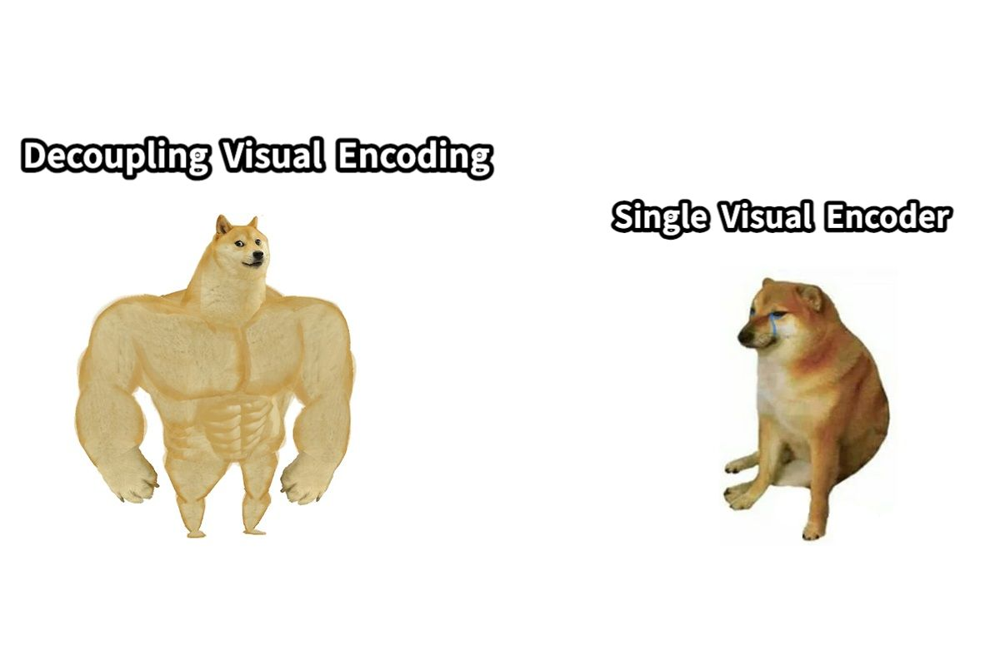

<h1 align="center"> 
    
</h1>


Open Janus aims to reproduce [Janus](https://github.com/deepseek-ai/Janus) from scrach.
Janus is a unified vision-language understanding and generation foundation model released by the DeepSeek team. 
Their team has released the inference code and pre-trained weights, but training code is not available.


## A Quick Overview 

 ## News
 - [TOP] We have released Open Janus, a full training pipeline to train Janus from scratch.
 - 25-03-08. This project is still quickly updating 🌝. Check TODO list to see what will be released next.

 ## Our Performance
 
### Visual Examples

#### Prompt: *A close-up high-contrast photo of Sydney Opera House sitting next to Eiffel tower, under a blue night sky of roiling energy, exploding yellow stars, and radiating swirls of blue..*  

**Output** :  


#### Prompt: *What is this meme trying to express*
 **Image** :
 
**Output** : *Assistant: The meme is trying to express the difference between two types of neural networks: "Decoupling Visual Encoding" and "Single Visual Encoder." The image uses the Shiba Inu (a breed of dog) to visually represent the two concepts. The "Decoupling Visual Encoding" is depicted as a muscular, strong dog, while the "Single Visual Encoder" is shown as a smaller, less muscular dog sitting down. This visual metaphor is used to contrast the two approaches to neural network architecture, highlighting the idea that a more powerful and efficient system is needed for visual data processing.*

 
 ## Requirement
 Refer to [Janus](https://github.com/deepseek-ai/Janus) official:
On the basis of `Python >= 3.8` environment, install the necessary dependencies by running the following command:
```shell
pip install -e .
```
 
 ## Reproduction on Understanding and Generation Benchmarks
 ### Understanding

| Type | Model | # LLM Params | POPE ↑ | MME-P ↑ | MMB ↑ | SEED ↑ | VQAv2 (test) ↑ | GQA ↑ | MMMU ↑ | MM-Vet ↑ |
|---------------|--------------------------------|-------------|--------|---------|------|--------|---------------|------|-------|--------|
| **Und. Only** | LLaVA-v1.5-Phi-1.5 | 1.3B | 84.1 | 1128.0 | - | - | 75.3 | 56.5 | 30.7 | - |
| | MobileVLM | 1.4B | 84.5 | 1196.2 | 53.2 | - | - | 56.1 | - | - |
| | MobileVLM-V2  | 1.4B | 84.3 | 1302.8 | 57.7 | - | - | 59.3 | - | - |
| | MobileVLM  | 2.7B | 84.9 | 1288.9 | 59.6 | - | - | 59.0 | - | - |
| | MobileVLM-V2 | 2.7B | 84.5 | 1404.5 | 63.2 | - | - | 61.1 | - | - |
| | LLaVA-Phi  | 2.7B | 85.0 | 1335.1 | 59.8 | - | 71.4 | - | 28.9 | - |
| | LLaVA  | 7B | 76.3 | 809.6 | 64.3 | 33.5 | - | - | - | - |
| | LLaVA-v1.5  | 7B | 85.9 | 1510.7 | 64.3 | 58.6 | 78.5 | 62.0 | 35.4 | 31.1 |
| | InstructBLIP | 7B | - | - | 36.0 | 53.4 | - | 49.2 | - | 26.2 |
| | Qwen-VL-Chat | 7B | - | 1487.5 | 60.6 | 58.2 | 78.2 | 57.5 | - | - |
| | IDEFICS-9B  | 8B | - | - | 48.2 | - | 50.9 | 38.4 | - | - |
| | Emu3-Chat | 8B | 85.2 | - | 58.5 | 68.2 | 75.1 | 40.7 | 31.6 | - |
| | InstructBLIP  | 13B | 78.9 | 1212.8 | - | - | - | 49.5 | - | 25.6 |
| **Und. and Gen.** | DreamLLM† | 7B | - | - | - | - | 72.9 | - | - | 36.6 |
| | LaVIT†  | 7B | - | - | - | - | 66.0 | 46.8 | - | - |
| | Emu† | 13B | - | - | - | - | 52.0 | - | - | - |
| | NExT-GPT†  | 13B | - | - | - | - | 66.7 | - | - | - |
| | Show-o  | 1.3B | 73.8 | 948.4 | - | - | 59.3 | 48.7 | 25.1 | - |
| | Gemini-Nano-1  | 1.8B | - | - | - | - | 62.7 | - | 26.3 | - |
| | LWM  | 7B | 75.2 | - | - | - | 55.8 | 44.8 | - | 9.6 |
| | VILA-U  | 7B | 85.8 | 1401.8 | - | 59.0 | 79.4 | 60.8 | - | 33.5 |
| | Chameleon  | 7B | - | - | - | - | - | 22.4 | 8.3 | - |
| | **Janus (Reported)** | 1.3B | 87.0 | 1338.0 | 69.4 | 63.7 | 77.3 | 59.1 | 30.5 | 34.3 |
| | **Janus (Reproduced)** | 1.3B | - | - | - | - | 74.0 | 53.4 | - | - |
 ### Generation
We set seed to ```42```
| Type | Method | # Params | Single Obj. | Two Obj. | Counting | Colors | Position | Color Attri. | Overall ↑ |
|---------------|--------------|----------|-------------|----------|----------|--------|----------|--------------|------------|
| **Gen. Only** | LlamaGen  | 0.8B | 0.71 | 0.34 | 0.21 | 0.58 | 0.07 | 0.04 | 0.32 |
| | LDM  | 1.4B | 0.92 | 0.29 | 0.23 | 0.70 | 0.02 | 0.05 | 0.37 |
| | SDv1.5  | 0.9B | 0.97 | 0.38 | 0.35 | 0.76 | 0.04 | 0.06 | 0.43 |
| | PixArt-α | 0.6B | 0.98 | 0.50 | 0.44 | 0.80 | 0.08 | 0.07 | 0.48 |
| | SDv2.1  | 0.9B | 0.98 | 0.48 | 0.40 | 0.77 | 0.07 | 0.05 | 0.50 |
| | DALL-E 2  | 6.5B | 0.94 | 0.66 | 0.49 | 0.77 | 0.17 | 0.17 | 0.52 |
| | Emu3-Gen  | 8B | 0.98 | 0.71 | 0.34 | 0.81 | 0.17 | 0.21 | 0.54 |
| | SDXL | 2.6B | 0.98 | 0.74 | 0.39 | 0.85 | 0.15 | 0.23 | 0.55 |
| **Und. and Gen.** | SEED-X†  | 17B | 0.97 | 0.58 | 0.26 | 0.80 | 0.19 | 0.14 | 0.49 |
| | Show-o  | 1.3B | 0.95 | 0.52 | 0.49 | 0.82 | 0.11 | 0.28 | 0.53 |
| | LWM  | 7B | 0.93 | 0.41 | 0.46 | 0.79 | 0.09 | 0.15 | 0.47 |
| | Chameleon  | 34B | - | - | - | - | - | - | 0.39 |
| | **Janus (Reported)** | 1.3B | 0.97 | 0.68 | 0.30 | 0.84 | 0.46 | 0.42 | 0.61 |
| | **Janus (Reproduced)** | 1.3B | 0.70 | 0.38 | 0.13 | 0.50 | 0.16 | 0.17 | 0.34 |
 ## Run 
 ### Training
Training Understanding Tasks.
```shell
python train.py
```
Training Generation Tasks.
```shell
python train_generation.py
```

 ### Evaluation
 The evaluation code is adapted from [LLaVA](https://github.com/haotian-liu/LLaVA) with modifications to suit our model.

 Before preparing task-specific data, **you MUST first download [eval.zip](https://drive.google.com/file/d/1atZSBBrAX54yYpxtVVW33zFvcnaHeFPy/view?usp=sharing)**. It contains custom annotations, scripts, and the prediction files with LLaVA v1.5. Extract to `./playground/data/eval`. This also provides a general structure for all datasets.
 
 #### VQAv2
 1. Download [`test2015`](http://images.cocodataset.org/zips/test2015.zip) and put it under `./playground/data/eval/vqav2`.
2. Single GPU Inference.
```Shell
python eval/ckpt2ans/eval_vqav2.py \
--image-folder playground/data/eval/vqav2/test2015 \
--question-file playground/data/eval/vqav2/llava_vqav2_mscoco_test-dev2015.jsonl \
--answer_file playground/data/eval/vqav2/answers/llava_vqav2_mscoco_test-dev2015/janus/merge.jsonl

python eval/ans2submission/vqav2_submission.py \
--split llava_vqav2_mscoco_test-dev2015 \
--ckpt janus
```
3. Submit the results to the [evaluation server](https://eval.ai/web/challenges/challenge-page/830/my-submission): `./playground/data/eval/vqav2/answers_upload`.

#### GQA

1. Download the [data](https://cs.stanford.edu/people/dorarad/gqa/download.html) and [evaluation scripts](https://cs.stanford.edu/people/dorarad/gqa/evaluate.html) following the official instructions and put under `./playground/data/eval/gqa/data`. You may need to modify `eval.py` as [this](https://gist.github.com/haotian-liu/db6eddc2a984b4cbcc8a7f26fd523187) due to the missing assets in the GQA v1.2 release.
2. Multi-GPU inference.
```Shell
CUDA_VISIBLE_DEVICES=0,1,2,3,4,5,6,7 bash scripts/v1_5/eval/gqa.sh
```


#### Geneval
From [Geneval](https://github.com/djghosh13/geneval), download the [evaluation_metadata.jsonl](https://github.com/djghosh13/geneval/blob/main/prompts/evaluation_metadata.jsonl) and put it in `./playground/data/eval/geneval/evaluation_metadata.jsonl.`

1. Generate image samples.
You can add the following lines to `gen_eval.py` to ensure the reproducibility.

```python
from pytorch_lightning import seed_everything

for index, metadata in enumerate(metadatas):
    ## Add Seed Here.
    seed_everything(opt.seed)
```

```shell
python eval/ckpt2ans/gen_eval.py --outdir playground/data/eval/geneval/data --n_samples 4
```
Onece you generate the image samples, follow the [environment setup](https://github.com/djghosh13/geneval/issues/12) instructions in [Geneval](https://github.com/djghosh13/geneval) to evaluate your samples.

 ## TODO LIST

- [ ] More Evaluation Results.
- [ ] DDP training pipeline.
- [ ] Clean the code.
 ## How to contribute

 ## Acknowledgement
 [Janus](https://github.com/deepseek-ai/Janus): The codebase we built upon.

 [LLaVA](https://github.com/haotian-liu/LLaVA): The evaluation code we refer to.
 ## Cite
 ~~~
release soon
 ~~~


